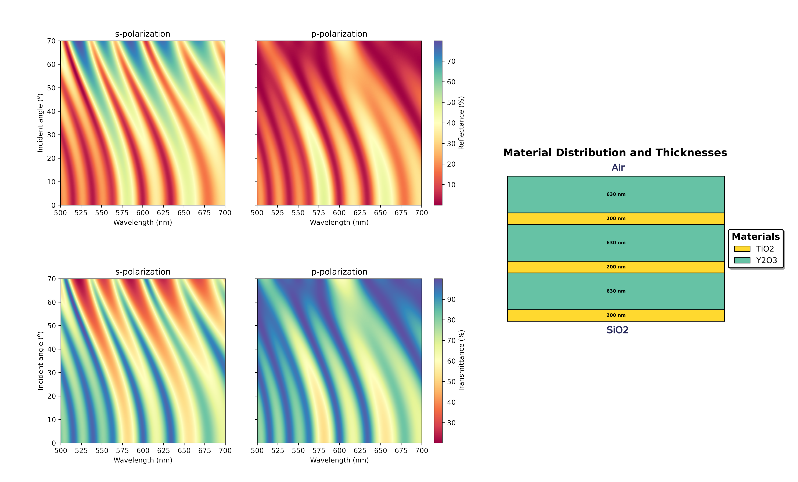

# **TMMax: High-performance modeling of multilayer thin-film structures using transfer matrix method with JAX**

[](https://pypi.org/project/tmmax/)
[](https://github.com/serhatdann/tmmax/blob/main/LICENSE)
[](https://tmmax.readthedocs.io/en/latest/index.html)
[](https://doi.org/10.48550/arXiv.2507.11341)
[](https://joss.theoj.org/papers/712c9ff83afb445ed24c166759c8093b)
[](https://doi.org/10.5281/zenodo.17361546)

<div align="center">
  <a href="https://pypi.org/project/tmmax/">
    
  </a>
</div>

<!-- TABLE OF CONTENTS -->
<details>
  <summary>Table of Contents</summary>
  <ol>
    <li><a href="#introduction">Introduction</a></li>
    <li><a href="#documentation">Documentation</a></li>
    <li><a href="#usage">Usage</a></li>
    <li><a href="#database">Database</a></li>
    <li><a href="#benchmarks">Benchmarks</a></li>
    <li><a href="#installation">Installation</a></li>
    <li><a href="#license">License</a></li>
    <li><a href="#credits">Credits</a></li>
    <li><a href="#contact-and-support">Contact and Support</a></li>
  </ol>
</details>

## Introduction

`tmmax` is a high-performance computational library designed for efficient calculation of optical properties in multilayer thin-film structures. Engineered to serve as a Swiss Army knife tool for thin-film optics research, `tmmax` integrates a comprehensive suite of advanced numerical methods. At its core, `tmmax` leverages JAX to enable just-in-time (JIT) compilation, vectorization and XLA (Accelerated Linear Algebra) operations, dramatically accelerating the evaluation of optical responses in multilayer coatings. By exploiting these capabilities, `tmmax` achieves exceptional computational speed, making it the optimal choice for modeling and analyzing complex systems.

Originally architected for CPU-based execution to ensure accessibility and scalability across diverse hardware configurations, `tmmax` seamlessly extends its computational efficiency to GPU and TPU platforms, thanks to JAX’s unified execution model. This adaptability ensures that high-performance simulations can be executed efficiently across a range of computing environments without modifying the core implementation. Moreover, `tmmax` natively supports automatic differentiation through JAX’s powerful autograd framework, allowing users to compute analytical gradients of optical properties with respect to arbitrary system parameters. This capability makes it particularly well-suited for gradient-based inverse design, machine learning-assisted optimization, and parameter estimation in photonic applications, providing a direct pathway to next-generation thin-film engineering.


## Documentation

The complete documentation for TMMax is available in the [TMMax Read The Docs](https://tmmax.readthedocs.io/en/latest/). This repository provides an extensive set of examples demonstrating the key functionalities of tmmax, enabling users to efficiently analyze and manipulate multilayer thin-film stacks.

The examples cover fundamental and advanced use cases, including:

- Material Database Management: Retrieving wavelength-dependent refractive index (n) and extinction coefficient (k) data from the built-in material database. Users can seamlessly add new materials, modify existing entries, or remove materials while maintaining database integrity.

- Thin-Film Optical Properties: Computing reflection (R), transmission (T), and absorption (A) spectra for both coherent and incoherent multilayer thin-film structures.

- Filter Design and Optimization: Rapid simulation of optical filters, showcasing how tmmax efficiently models various thin-film coatings, such as anti-reflective coatings, high-reflectivity mirrors, and bandpass filters.

## Usage

To compute the reflection and transmission spectra of a multilayer thin-film stack using the tmmax framework, consider the following example. Suppose we have a coherent multilayer structure consisting of [Air, Y₂O₃, TiO₂, Y₂O₃, TiO₂, Y₂O₃, TiO₂, SiO₂], where the incident wavelength varies from 500 nm to 700 nm, and the angle of incidence spans from 0° to 70°. The calculation is performed as follows:

```python
import jax.numpy as jnp
from tmmax.tmm import tmm

# Define your multilayer stack and simulation parameters

material_list = ["Air", "Y2O3", "TiO2", "Y2O3", "TiO2", "Y2O3", "TiO2", "SiO2"]
thickness_list = jnp.array([630e-9, 200e-9, 630e-9, 200e-9, 630e-9, 200e-9])  
wavelength_arr  = jnp.linspace(500e-9, 700e-9, 1000)
angle_of_incidences  = jnp.linspace(0, (70*jnp.pi/180), 1000)
polarization = 's'

R_s, T_s = tmm(material_list = material_list,
               thickness_list = thickness_list,
               wavelength_arr = wavelength_arr,
               angle_of_incidences = angle_of_incidences,
               polarization = polarization)

polarization = 'p'

R_p, T_p = tmm(material_list = material_list,
               thickness_list = thickness_list,
               wavelength_arr = wavelength_arr,
               angle_of_incidences = angle_of_incidences,
               polarization = polarization)
```

<div align="center">
  
</div>

For cases where an incoherent layer is introduced within the stack, the simulation should include averaging effects of "thick" layers. In tmmax, incoherent layers are denoted by `1`, while coherent layers remain as `0`. The following example demonstrates the configuration of the same stack with incoherent layers:

```python
import jax.numpy as jnp
from tmmax.tmm import tmm

# Define your multilayer stack and simulation parameters

material_list = ["Air", "Y2O3", "TiO2", "Y2O3", "TiO2", "Y2O3", "TiO2", "SiO2"]
thickness_list = jnp.array([2000e-9, 100e-9, 2000e-9, 100e-9, 2000e-9, 100e-9])
coherency_list = jnp.array([1, 0, 1, 0, 1, 0])
wavelength_arr  = jnp.linspace(500e-9, 700e-9, 1000)
angle_of_incidences  = jnp.linspace(0, (70*jnp.pi/180), 1000)
polarization = 's'

R_s, T_s = tmm(material_list = material_list,
               thickness_list = thickness_list,
               wavelength_arr = wavelength_arr,
               angle_of_incidences = angle_of_incidences,
               coherency_list = coherency_list,
               polarization = polarization)

polarization = 'p'

R_p, T_p = tmm(material_list = material_list,
               thickness_list = thickness_list,
               wavelength_arr = wavelength_arr,
               angle_of_incidences = angle_of_incidences,
               coherency_list = coherency_list,
               polarization = polarization)
```

## Database

The `tmmax` repository features a database of 29 materials commonly used in optical thin film research. These materials is selected based on their prevalence in the field, as highlighted in the 18th chapter of _Thin-Film Optical Filters, Fifth Edition by H. Angus Macleod_ [doi](https://doi.org/10.1201/b21960). However, it’s important to clarify that these materials are not directly sourced from the book; rather, the book provides a reference for materials typically utilized in thin-film optics studies. The material data, including refractive index (n) and extinction coefficient (k) values, is available in the `tmmax/nk_data` folder in both .csv and .npy formats. While the initial data was stored in .csv format, the repository switched to .npy to leverage JAX’s faster data loading capabilities, as reading .csv files was slower in comparison.

Most of the refractive index and extinction coefficient data for the materials in the database is obtained from [refractiveindex.info](https://refractiveindex.info/), which itself aggregates data from various research articles. To ensure proper attribution, we will provide references to the original sources for each material in the `docs/database_info` folder. You can access these references by reviewing the `README` file in that directory. 

For example, to visualize the n and k data for SiO2, a material with widely accepted optical properties, you can use the `visualize_material_properties(material_name = "SiO2")` function in the `tmmax/nk_data`. This allows for a straightforward representation of the material's refractive index and extinction coefficient.


<div align="center">
  
</div>

The database is designed to be extensible, and we plan to include additional materials in future versions of tmmax. Contributions are welcome, and if you have a material you would like to add, please feel free to open an issue or submit a pull request. 

## Benchmarks

In evaluating the performance of various transfer matrix method implementations, we conducted rigorous benchmarking to compare runtime efficiency as a function of layer count, wavelength array length, and angle of incidence array length. Given that optical multilayer coatings can contain a substantial number of layers based on design constraints and performance sensitivity, scalability is a critical factor. To ensure a fair comparison, all tests were executed under identical conditions, including hardware specifications and input parameters.

### Layer Size vs Run Time

One of the primary factors influencing computational complexity in tmm simulations is the number of layers in the multilayer stack. We benchmarked [`tmm`](https://github.com/sbyrnes321/tmm) and `tmmax` to assess their performance under increasing layer counts. The results indicate that as the number of layers grows, tmmax demonstrates good scalability compared to other implementations. This makes tmmax particularly well-suited for simulating highly complex multilayer structures without significant degradation in performance.

<div align="center">
  
</div>

### Wavelength and Angle of Incidence Array Lengths vs Run Time

<div align="center">
  
</div>


## Minimum Requirements and Installation

- **Python**: ≥ 3.10  
- **Operating System**: Linux, macOS, or Windows  
- **Dependencies**:
  - `jax>=0.5.0`
  - `jaxlib>=0.5.0`
  - `numpy>=2.2.2`
  - `scipy>=1.15.1`
  - `pandas>=2.2.3`
  - `matplotlib>=3.10.0`

These dependencies are automatically installed when you install TMMax via pip.

```bash
pip install tmmax
```

## Install from Source

```bash
git clone https://github.com/bahremsd/tmmax.git
cd tmmax
pip install .
```

You may also install optional dependencies for documentation, testing, or development:

```bash
pip install tmmax[test]
pip install tmmax[docs]
pip install tmmax[dev]
```

## Running TMMax on CPU, GPU, and TPU

TMMax can run on multiple hardware backends via JAX — CPU by default, GPU or TPU if available.

### 1. Running TMMax on CPU (Default)

By default, JAX installs CPU-only binaries.

**Installation:**

```bash
pip install -U jax jaxlib
```

**Verification:**

```bash
python -c "import jax; print(jax.devices())"
```

**Example output:**

```
[CpuDevice(id=0)]
```

If you see `CpuDevice(id=0)`, TMMax is running on CPU.

---

### 2. Running TMMax on NVIDIA GPU

If your system has a CUDA-capable GPU, install JAX with GPU support.

**Uninstall existing JAX (CPU-only):**

```bash
pip uninstall jax jaxlib -y
```

**Install CUDA-enabled JAX (example for CUDA 12):**

```bash
pip install -U "jax[cuda12]" -f https://storage.googleapis.com/jax-releases/jax_cuda_releases.html
```

**Verify GPU detection:**

```bash
python -c "import jax; print(jax.devices())"
```

**Example output:**

```
[GpuDevice(id=0, process_index=0)]
```

If you see `GpuDevice`, TMMax will automatically use GPU acceleration.

**Common Tips:**

- Ensure CUDA Toolkit and cuDNN are installed correctly.  
- No need to modify TMMax code — JAX automatically handles device dispatching.

---

### 3. Running TMMax on TPU (Google Cloud / Colab)

TMMax also supports TPU computation through JAX on Google Cloud or Colab TPUs.

**To use TPU on Colab:**

1. Go to **Runtime → Change runtime type → TPU**  
2. Run the setup cell:

```python
import jax
print(jax.devices())
```

**Expected output:**

```
[TpuDevice(id=0), TpuDevice(id=1), ...]
```

JAX automatically configures TPU execution in TMMax — no code modification required.

For production or HPC TPU environments, follow the official JAX TPU installation guide: [JAX TPU Installation Guide](https://jax.readthedocs.io/en/latest/installation.html#tpu)

---

## Running Tests

TMMax includes a robust **Pytest-based test suite** for validation and performance benchmarking.

### Run All Tests

```bash
pytest
```

### Run Tests with Coverage Report

```bash
pytest --cov=tmmax --cov-report=term-missing
```

### Run Specific Test Files

```bash
pytest tests/test_benchmark.py
pytest tests/test_integration.py
```

### Benchmark Validation

TMMax includes performance benchmarks for JAX and vectorized TMM implementations.  
To verify benchmark correctness:

```bash
pytest tests/test_benchmark.py -v
```

Expected output should include timing comparisons and correctness assertions for saved benchmark files.

---

## Development

Contributions are welcome! To set up a development environment:

```bash
git clone https://github.com/bahremsd/tmmax.git
cd tmmax
pip install -e .[dev]
```

Before submitting a pull request, please:

- Run code formatting:

```bash
black tmmax
ruff check tmmax
```

- Run all tests:

```bash
pytest
```


## Contributing

We warmly welcome contributions from the community to improve TMMax. This project thrives thanks to the collaborative effort of researchers, engineers, and enthusiasts in the field of optical multilayer thin-film simulations. Whether you are fixing a bug, suggesting a new feature, improving documentation, or enhancing performance, your input is highly valued and appreciated. For detailed instructions on how to contribute, please see the
[Contribution Guidelines](https://tmmax.readthedocs.io/en/latest/contributing.html)
in the documentation.


## License

This project is licensed under the [MIT License](https://opensource.org/license/MIT), which permits free use, modification, and distribution of the software, provided that the original copyright notice and license terms are included in all copies or substantial portions of the software. For a detailed explanation of the terms and conditions, please refer to the [LICENSE](https://github.com/bahremsd/tmmax/blob/master/LICENSE) file.

## Credits

This repository sometimes utilizes approaches from Steven Byrnes' [`tmm`](https://github.com/sbyrnes321/tmm) library, and we thank him for its development. In the context of calculating the optical properties of incoherent multilayer thin films, we used the approach from a paper by _Charalambos C. Katsidis and Dimitrios I. Siapkas, "General transfer-matrix method for optical multilayer systems with coherent, partially coherent, and incoherent interference"_ (Applied Optics, 41(19):3978) 2002 [doi](https://doi.org/10.1364/AO.41.003978).


If you find the `tmmax` library beneficial in your work, we kindly ask that you consider citing us.

```bibtex
@article{tmmax, 
  doi = {10.21105/joss.09088}, 
  url = {https://doi.org/10.21105/joss.09088}, 
  year = {2025}, publisher = {The Open Journal}, 
  volume = {10}, number = {114}, pages = {9088}, 
  author = {Danis, Bahrem Serhat and Zayim, Esra}, 
  title = {TMMax: High-performance modeling of multilayer thin-film structures using transfer matrix method with JAX}, 
  journal = {Journal of Open Source Software} 
}
```

## Contact and Support

For any questions, suggestions, or issues you encounter, feel free to [open an issue](https://github.com/bahremsd/tmmax/issues) on the GitHub repository. This not only ensures that your concern is shared with the community but also allows for collaborative problem-solving and creates a helpful reference for similar challenges in the future. If you would like to collaborate or contribute to the code, you can contact me via email.

Bahrem Serhat Danis - bdanis23@ku.edu.tr
